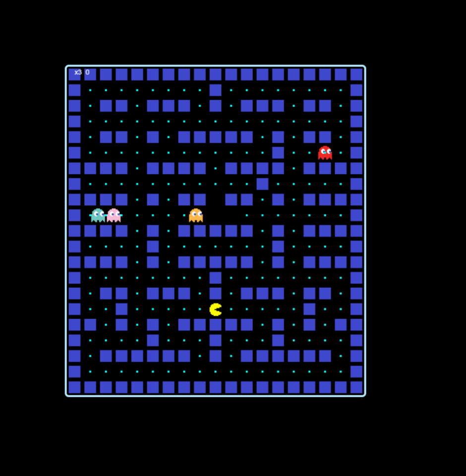

# 🟡 Pac-Man Game (Clone by Tamaghna)

Welcome to **Lord Nag's** retro remake of the iconic arcade game — **Pac-Man** — built entirely using vanilla **HTML, CSS, and JavaScript**. This browser-based version is lightweight, responsive, and fully playable online.



---

## 🎮 Live Game
Play the game instantly via GitHub Pages:
👉 **[Click Here to Play](https://pacman.tamaghnatech.in/)**

---

## 📌 Game Overview
This Pac-Man clone replicates the essential mechanics of the original classic:
- Eat all food pellets on the map
- Avoid dynamic ghosts that chase you
- Use arrow keys or WASD to control movement
- Score points and survive with limited lives

The game is rendered on a scalable HTML5 `<canvas>` element with pixel-perfect positioning and simple game loop logic.

---

## 🧱 Technologies Used
| Technology | Purpose |
|------------|---------|
| HTML5 | Structure and Canvas rendering |
| CSS3 | Styling and responsive layout |
| JavaScript (Vanilla) | Game logic, controls, collision, AI |

---

## 🗺️ Game Board Details
- **Tile Size:** 32x32 pixels
- **Grid Dimensions:** 21 rows × 19 columns
- **TileMap Encoding:**
  - `'X'` = Wall
  - `' '` = Food pellet
  - `'P'` = Pac-Man starting position
  - `'b'`, `'o'`, `'p'`, `'r'` = Ghosts (Blue, Orange, Pink, Red)
  - `'O'` = Empty / unused tile

---

## 🚀 Features
- 🟡 Real-time Pac-Man movement with smooth grid transitions
- 👻 Multiple ghosts with randomized starting directions
- 🍽️ Scoring system (+10 per food pellet)
- ❤️ Life tracker (starts with 3 lives)
- 💀 Game-over screen and auto-restart
- 📏 Responsive scaling for smaller screens

---

## 🧠 Game Architecture

### 1. **Game Loop**
- `update()` called every 50ms (~20 FPS)
- Handles movement, collision, redrawing

### 2. **Entities**
- All dynamic objects (`Pac-Man`, `Ghosts`, `Walls`, `Food`) are instances of the `Block` class

### 3. **Collision Detection**
- Rectangular overlap check using bounding box logic

### 4. **Input Handling**
- Arrow keys and WASD both supported via `keyup` listener

---

## 📷 Visual Snapshot
Include `game.png` in the repo root showing the active game screen for reference:

```html

```

---

## 📁 File Structure
```bash
pacman_game/
├── index.html          # Main entry point
├── pacman.css          # Game styles
├── pacman.js           # Game logic
├── wall.png            # Wall tile sprite
├── pacman*.png         # Pac-Man directional sprites
├── *.png (ghosts)      # Ghost sprites (b/o/p/r)
└── pic.png             # Screenshot preview
```

---

## 🛠️ Local Setup
Clone the repository and open `index.html` in any modern browser:
```bash
git clone https://github.com/tamaghnatech/pacman_game.git
cd pacman_game
open index.html  # or just double-click the file
```

No build tools or libraries required. Pure HTML/JS/CSS.

---

## 🔮 Future Improvements
- Add energizer mechanics (power pellets)
- Improve ghost AI (e.g., scatter vs chase logic)
- Sound effects and background music
- Mobile-friendly swipe controls
- Leaderboard via localStorage

---

## 👑 Author
**Tamaghna Nag (Lord Nag)**  
Game Dev | ML Engineer | Web Wizard  
🔗 GitHub: [@tamaghnatech](https://github.com/tamaghnatech)

---

## 📜 License
MIT License – feel free to fork, modify, and deploy your own Pac-Man world!
